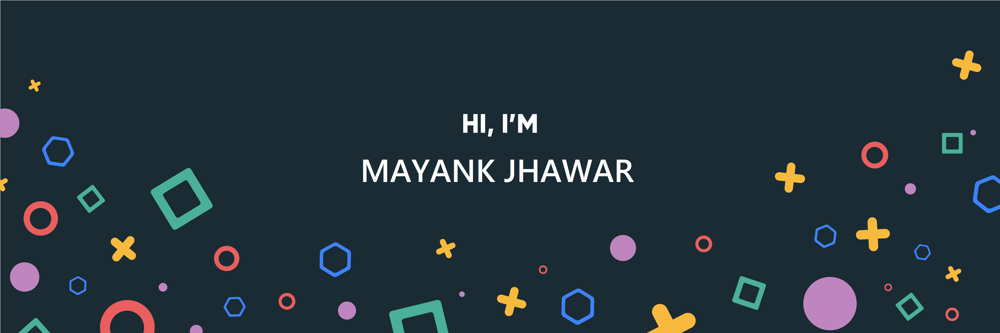

### Hi there 

I’m Mayank, a senior full-stack engineer, creative coder and self-proclaimed designer who specializes in front-end development. I make it my mission to translate user-focused designs into pixel-perfect websites or applications that run blazing fast.

Want to know more about me? [Check out my Resume.](https://2.flexiple.com/freelancer/mayank-jhawar)

- 🔭 I’m working on something cool :wink:
- 🌱 I’m passionate developer exploring new tech stack.
- 💬 Ask me about anything related to Javascript/Typescript/Vue/Node/Express/.Net
- ⚡ Fun fact: I :heart: coding :wink:

 
## &#x1f4c8; GitHub Stats

 

 
 

## 💼 Skills

More Skills

 

 

 

 

## 📣 Keep Motivate yourself - 

